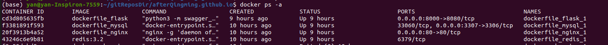
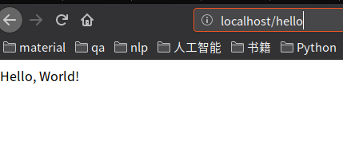

# docker-compose 多容器协作部署

## Docker基础知识

### 容器是什么

容器可能不如虚拟机一样为人所熟知，但是它们是另外的一种提供操作系统虚拟化的方法。然而，他们与标准的虚拟机有很大的差异。

标准的虚拟机通常包含一个完整的操作系统，OS软件包，最后包含一两个应用。它是通过一个向虚拟机提供了硬件虚拟化的Hypervisor来实现的，允许单个服务器运行很多独立的被当做虚拟游客（virtual guest）的操作系统。

而容器与虚拟机的类似之处在于它们允许单个服务器运行多个操作环境（operating environment），然而这些环境不却是完整的操作系统。容器通常只包含必要的OS软件包和应用。他们通常不包含一个完整的操作系统或者硬件虚拟化。这也意味着比之虚拟机，容器的额外开销（overhead）更小。

    容器和虚拟机通常被视为不能共生的技术，然而这通常是一个误解。虚拟机面向物理服务器，提供可以能与其他虚拟机一起共享这些物理资源的，功能完善的操作环境。容器通常是用来通过对单一主机的一个进程进行隔离，来保证被隔离的进程无法与处于同一个系统的其他进程进行互动。实际上，比起完全的虚拟机，容器与BSD的Jail，chroot的进程更加类似。


### Docker是什么

Docker 最初是 dotCloud 公司创始人 Solomon Hykes 在法国期间发起的一个公司内部项目，它是基于 dotCloud 公司多年云服务技术的一次革新，并于 2013 年 3 月以 Apache 2.0 授权协议开源，主要项目代码在 GitHub 上进行维护。

Docker 使用 Google 公司推出的 Go 语言 进行开发实现，基于 Linux 内核的 cgroup，namespace，以及AUFS 类的 Union FS 等技术，对进程进行封装隔离，属于 操作系统层面的虚拟化技术。由于隔离的进程独立于宿主和其它的隔离的进程，因此也称其为容器。

Docker 自身并不是一个容器的运行时环境。 Docker 提供的是一种容器管理，打包和部署的方法。尽管这种类型的功能已经某一种程度地存在于虚拟机中，但在传统上，它们并不是为了绝大多数的容器方案而生的，而那些已经存在的，却又不如 Docker 一样容易使用且功能完善。

Docker 在容器的基础上，进行了进一步的封装，从文件系统、网络互联到进程隔离等等，极大的简化了容器的创建和维护。使得 Docker 技术比虚拟机技术更为轻便、快捷。

### 为什么要用Docker

环境配置一直是软件开发的麻烦之一。用户计算机的环境都不相同，同样的软件，换了一台机器可能根本无法运行。环境包括操作系统的设置，各种库和组件的安装。只有它们都正确，软件才能运行。举例来说，安装一个 Python 应用，计算机必须有 Python 引擎，还必须有各种依赖，可能还要配置环境变量。

环境配置如此麻烦，换一台机器，就要重来一次，让人身心俱疲。那么，软件可不可以附带环境安装？也就是说，安装的时候，能否把可运行的原始环境复制过来？ Docker就是来解决这个问题的。

### Dockerfile

Dockerfile 是Docker镜像的配置文件，使用它可以快速完成自定义镜像，然后一条命令（docker build）完成构建。显然配置文件的方式可以更好地应对需求的变更。

Dockerfile的文档地址：
https://docs.docker.com/engine/reference/builder/

#### Dockerfile 配置示例

基本功能是通过已有代码快速搭建服务器环境
```
FROM alpine
ENV PATH /usr/local/bin:$PATH
ENV LANG C.UTF-8
ENV PYTHON_VERSION 3.5
RUN mkdir -p /usr/src/app
WORKDIR /usr/src/app

COPY requirements.txt /usr/src/app/
RUN echo http://mirrors.ustc.edu.cn/alpine/v3.8/main > /etc/apk/repositories

RUN echo http://mirrors.ustc.edu.cn/alpine/v3.8/community >> /etc/apk/repositories

RUN apk add g++ jpeg-dev openjpeg-dev libressl-dev
RUN apk add --no-cache python3
RUN apk add --no-cache --virtual=build-dependencies g++ \
    build-base libffi-dev python3-dev \
    libffi openssl ca-certificates \
    zlib-dev freetype-dev lcms2-dev  tiff-dev tk-dev tcl-dev \
    linux-headers pcre-dev   
RUN pip3 install --no-cache-dir --default-timeout=100  -r requirements.txt -i http://pypi.douban.com/simple/ --trusted-host pypi.douban.com  


COPY . /usr/src/app

EXPOSE 8080

ENTRYPOINT ["python3"]

CMD ["-m", "swagger_server"]
```

## Docker-compose 基础知识
### Docker-compose 是什么

Docker Compose 是 Docker 官方编排（Orchestration）项目之一，负责快速的部署分布式应用。

Compose 定位是 「定义和运行多个 Docker 容器的应用（Defining and running multi-container Docker applications）」，其前身是开源项目 Fig。Compose 项目由 Python 编写，实现上调用了 Docker 服务提供的 API 来对容器进行管理。因此，只要所操作的平台支持 Docker API，就可以在其上利用 Compose 来进行编排管理。

通过之前对于 docker 的简单介绍，我们知道使用一个 Dockerfile 模板文件，可以让用户很方便的定义一个单独的应用容器。然而，在日常工作中，经常会碰到需要多个容器相互配合来完成某项任务的情况。例如要实现一个 Web 项目，除了 Web 服务容器本身，往往还需要再加上后端的数据库服务容器，甚至还包括负载均衡容器等。

### docker-compose.yml 文件配置

Docker Compose 通过项目根目录下陈述性语言 yaml 文件 docker-compose.yml 中定义项目所要用到的所有容器，网络，或者挂载的信息。然后运行一个简单的命令 docker-compose up 即可以进行一键部署。

#### 服务端结构
```

├── pack
│   ├── docker-compose.yml
│   ├── flask
│   │   ├── Dockerfile
│   │   ├──swagger_server
│   ├── mysql
│   │   ├── Dockerfile
│   │   ├──swagger_server
│   │   ├──init.sql
│   ├── nginx
│   │   ├── Dockerfile
│   │   ├── config
│   │   │   ├── nginx.conf

```

#### docker-compose 文件

```
version: '3'
services:
  mysql:
    build: ./mysql
    ports: 
      - "3306:3306"
    environment:
      - MYSQL_ROOT_PASSWORD=password
    restart: always
    networks:
       ZXQ:
        aliases:
         - mysql-server
  redis:
    image: redis:3.2
    restart: always    
    networks:
       ZXQ:
        aliases:
        - redis-server
  flask:
    build: ./flask
    ports:
      - 8000:8080
    networks:
      - ZXQ
    restart: always
  nginx: 
    build: ./nginx 
    ports: 
      - "80:80" 
    networks:
      - ZXQ
networks:
  ZXQ:
  
```

#### 各个容器的构建

我们需要在 services 标签下指定各个容器的名字和基本属性。
基础语法

- build

    指定 Dockerfile 所在文件夹的路径（可以是绝对路径，或者相对 docker-compose.yml 文件的路径）。 Compose 将会利用它自动构建这个镜像，然后使用这个镜像。
- image
    
    对于可以直接使用原始镜像，不用进行二次 build 的 service 来说，可以使用 image 标签来指定使用的镜像。（需要 build 的镜像在它们各自的 Dockerfile 中指定了初始的镜像）
- ports
    暴露端口信息。使用宿主端口：容器端口 (HOST:CONTAINER) 格式，或者仅仅指定容器的端口（宿主将会随机选择端口）都可以。
    此处，在 nginx 中将 host 的 8080 端口和 nginx 容器中的 80 端口关联起来。作为访问 web 服务的唯一入口，在 db 中的端口映射 3306:3306 只是为了暴露 mysql 的接口方便本地进行调试，实际部署到生产环境的时候可以去掉。
- restart
    设置 restart: always ，当容器意外退出的时候可以一直重启，保证容器跑的进程不会 exit，方便调试。
- networks
    指定该容器和哪些 networks 相连，其中 networks 在上一级的 networks 标签中指定。 

- volumes
    数据卷所挂载路径设置。可以设置宿主机路径 （HOST:CONTAINER） 或加上访问模式 （HOST:CONTAINER:ro）。该指令中路径支持相对路径。这样的话，在 docker-compose up 运行了整个服务后，修改本地代码文件即可以直接反映在对应的容器中，而不需要重启 docker-compose, 方便调试。
- depends_on
    解决容器的依赖、启动先后的问题。在这里 web 容器会等待 db 和 redis 容器都启动后才启动。
- command
    覆盖容器启动后默认执行的命令。此处运行了自己写的 sh 脚本 run-after-db-init.sh, web 会先一直向 db 的 3306 发送请求，直至成功连接后才启动服务 python app.py ，防止web 在 db 启动后， 初始化未完成时就尝试连接数据库导致连接失败的情况。
- stdin_open, tty
    上述两个设置为 true， 可以将容器内容的输出重定向到目前的终端上，方便调试。 

#### 各个容器的连接
services & networks

在 networks 标签下指定各个网络的名字和连接方式。常用的连接方式是桥接 bridge.

docker-compose 会在宿主机 (host) 的内部构建一个虚拟的网络环境，并且为各个容器分配了一个 ip 地址，services 中的各个容器的名字，比如 flask, db, nginx 将会被加载进 docker-compose 提供的 DNS 系统里面。这意味着我们可以在程序中直接使用 services 的名字作为 host 来实现连接。

flask 部分配置
```
#redis-session  config
SESSION_TYPE = 'redis'   #session存储格式为redis
SESSION_REDIS = Redis(    #redis的服务器参数
    host='redis',                 #服务器地址
    port=6379)                           #服务器端口
SESSION_USE_SIGNER = True   #是否强制加盐，混淆session
SECRET_KEY = os.urandom(24)  #如果加盐，那么必须设置的安全码，盐
SESSION_PERMANENT = False  #sessons是否长期有效，false，则关闭浏览器，session失效
PERMANENT_SESSION_LIFETIME = 3600   #session长期有效，则设定session生命周期，整数秒，默认大概不到3小时。
```

### 一键部署

在项目根目录下运行下面命令：

    docker-compose up

结果




### networks 详细配置

networks通常应用于集群服务，从而使得不同的应用程序得以在相同的网络中运行，从而解决容器间网络隔离问题。

一般对于集群服务，常常通过docker-compose.yml文档快速编排、部署应用服务。官网中给出了如下的使用场景和方式：

1. 未显式声明网络环境的docker-compose.yml

例如，在目录app下创建docker-compose.yml，内容如下：

version: '3'
services:
 web:
  mage: nginx:latest
  container_name: web
  depends_on:
   - db
  ports:
   - "9090:80"
  links:
   - db
 db:
  image: mysql
  container_name: db

使用docker-compose up启动容器后，这些容器都会被加入app_default网络中。使用docker network ls可以查看网络列表，docker network inspect <container id>可以查看对应网络的配置。
```
$ docker net work ls
NETWORK ID     NAME           DRIVER       SCOPE
6f5d9bc0b0a0    app_default       bridge       local
0fb4027b4f6d    bridge          bridge       local
567f333b9de8    docker-compose_default  bridge       local
bb346324162a    host           host        local
a4de711f6915    mysql_app        bridge       local
f6c79184ed27    mysql_default      bridge       local
6358d9d60e8a    none           null        local
```
2. networks关键字指定自定义网络

例如下面的docker-compose.yml文件，定义了front和back网络，实现了网络隔离。其中proxy和db之间只能通过app来实现通信。其中，custom-driver-1并不能直接使用，你应该替换为host, bridge, overlay等选项中的一种。

```
version: '3'

services:
 proxy:
  build: ./proxy
  networks:
   - front
 app:
  build: ./app
  networks:
   - front
   - back
 db:
  image: postgres
  networks:
   - back

networks:
 front:
  # Use a custom driver
  driver: custom-driver-1
 back:
  # Use a custom driver which takes special options
  driver: custom-driver-2
  driver_opts:
   foo: "1"
   bar: "2"
```


3. 配置默认网络

```
version: '2'

services:
 web:
  build: .
  ports:
   - "8000:8000"
 db:
  image: postgres

networks:
 default:
  # Use a custom driver
  driver: custom-driver
```
4. 使用已存在的网络
```
networks:
 default:
  external:
   name: my-pre-existing-network
```
5. 使用aliases代替link

一般的使用格式如下：
```
services:
 some-service:
  networks:
   some-network:
    aliases:
     - alias1
     - alias3
   other-network:
    aliases:
     - alias
```

参考链接

[https://blog.csdn.net/Kiloveyousmile/article/details/79830810](https://blog.csdn.net/Kiloveyousmile/article/details/79830810)

[https://blog.51cto.com/4925054/2342021](https://blog.51cto.com/4925054/2342021)

[https://www.longjj.com/2018/04/03/Docker-%E6%9E%84%E5%BB%BA%E9%95%9C%E5%83%8F%E5%85%A5%E9%97%A8%EF%BC%8C%E4%BB%A5-Python-Flask-%E4%B8%BA%E4%BE%8B/](https://www.longjj.com/2018/04/03/Docker-%E6%9E%84%E5%BB%BA%E9%95%9C%E5%83%8F%E5%85%A5%E9%97%A8%EF%BC%8C%E4%BB%A5-Python-Flask-%E4%B8%BA%E4%BE%8B/)

[https://www.zybuluo.com/longj/note/1173047](https://www.zybuluo.com/longj/note/1173047)