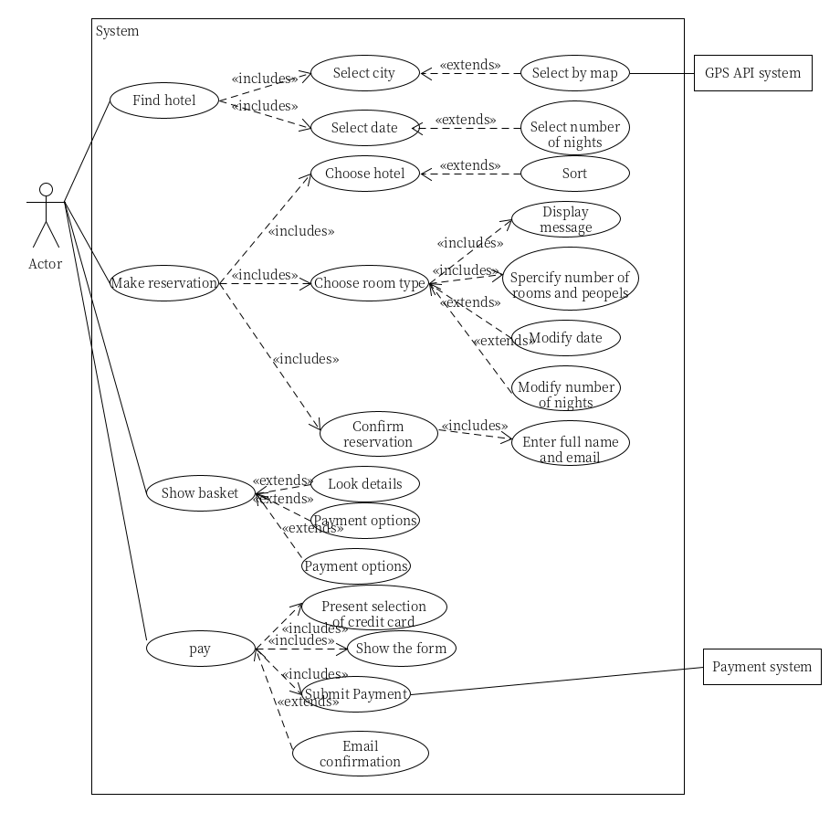
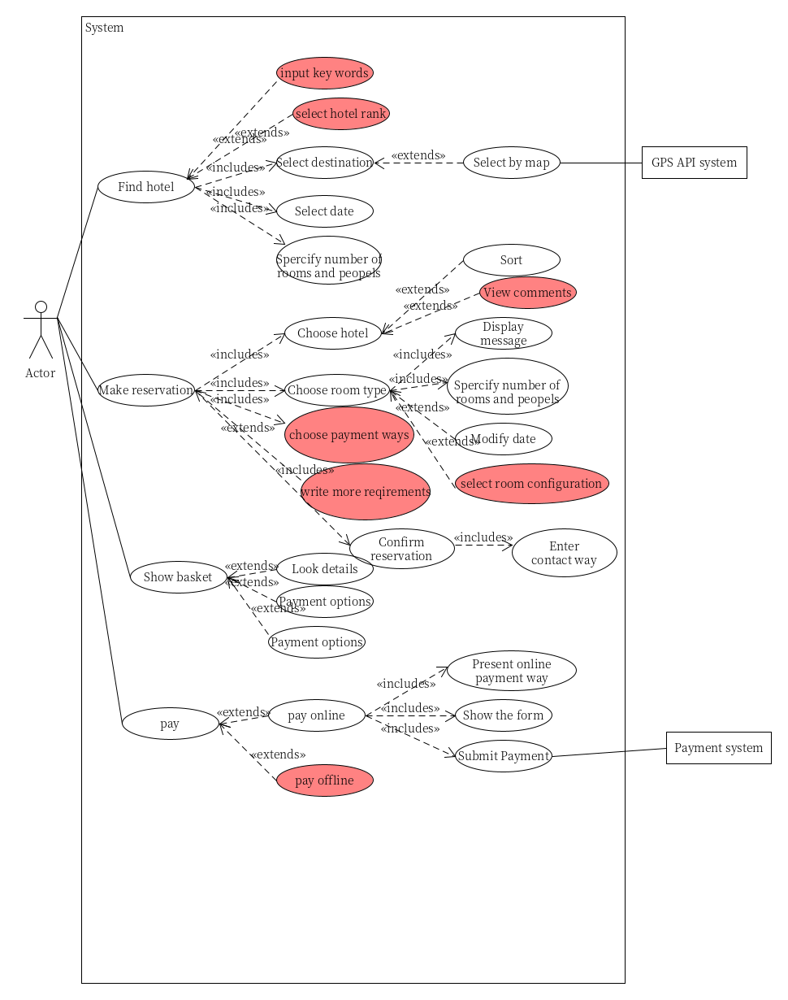

# fourthHomework

1、简答题

1. 用例的概念

    >A use case is a list of actions or event steps typically defining the interactions between a role (known in the Unified Modeling Language (UML) as an actor) and a system to achieve a goal. 
    
    一个用例定义了用户角色和系统为了达成某个目标所进行的交互，包括一系列动作和事件步骤。
    

2. 用例和场景的关系？什么是主场景或 happy path？

    >- A use case represents a collection of scenarios: primary,plus zero or more alternates.
    >  - The primary scenario（主场景／基本流）corresponds tothe main system interactions, usually the ‘success’ scenario.最常用，直接地实现用户目标的故事
    >- Alternate scenarios（可选场景／备选流）correspond toless    frequent    interactions    and    exceptions.在实现用户目标过程中较少适用与意外故事
    
3. 用例有哪些形式？

    三种格式 Brief, Casual, Fully
    - Brief (high level)
        - Terse one-paragraphsummary, usually of the main successscenario.
        - Duringearly requirements analysis, to get a quick sense of subjectand scope. May take only a few minutes to create.
    - Casual (简便格式)
        - Informal paragraph format. Multiple paragraphs that cover variousscenarios.
        - When? As above.
    - Fully
        - dressed All steps and variations are written in detail, and there aresupporting sections, such as preconditions and success guarantees.
        - After many use cases have been identified and written in a briefformat,then during the first requirements workshop a few (suchas 10%)of thearchitecturally significantandhigh-value usecasesare written in detail.
    
4. 对于复杂业务，为什么编制完整用例非常难？

    业务复杂，场景多，变化多，难以覆盖
    
5. 什么是用例图？

    > Use case diagram is an excellent pictureof the system context; 
    >- It makes a good context diagram,
    >- Showing the boundary of a system, what lies outside of it, and how it gets used. 
    >- It serves as a communication tool that summarizes the behavior of a system and its actors.

6. 用例图的基本符号与元素？
    用例图包6个元素，参与者，用例，关联关系，包含关系，扩展关系，泛化关系。

7. 用例图的画法与步骤

    - 确定参与者
    
        （1）谁将使用该系统的主要功能。  
        
        （2）谁将需要该系统的支持以完成其工作。 

        （3）谁将需要维护、管理该系统，以及保持该系统处于工作状态。  

        （4）系统需要处理哪些硬件设备。  

        （5）与该系统那个交互的是什么系统。 
        
        （6）谁或什么系统对本系统产生的结果感兴趣。
    - 识别用例 从分析系统的参与者开始，考虑每一个参与者是如何使用系统的。
    - 识别用例间的关系

8. 用例图给利益相关人与开发者的价值有哪些？

    > Use case diagram is an excellent pictureof the system context; 
    >- It makes a good context diagram,
    >- Showing the boundary of a system, what lies outside of it, and how it gets used. 
    >- It serves as a communication tool that summarizes the behavior of a system and its actors.
2、建模练习题（用例模型）

* 选择2-3个你熟悉的类似业务的在线服务系统（或移动 APP），如定旅馆（携程、去哪儿等）、定电影票、背单词APP等，分别绘制它们用例图。并满足以下要求：
    - 请使用用户的视角，描述用户目标或系统提供的服务
    - 粒度达到子用例级别，并用 include 和 exclude 关联它们
    - 请用色彩标注出你认为创新（区别于竞争对手的）用例或子用例
    - 尽可能识别外部系统和服务
* 然后，回答下列问题：
    1. 为什么相似系统的用例图是相似的？
    2. 如果是定旅馆业务，请对比 Asg_RH 用例图，简述如何利用不同时代、不同地区产品的用例图，展现、突出创新业务和技术
    3. 如何利用用例图定位创新思路（业务创新、或技术创新、或商业模式创新）在系统中的作用 
    4. 请使用 SCRUM 方法，选择一个用例图，编制某定旅馆开发的需求（backlog）开发计划表 
    5. 根据任务4，参考 [使用用例点估算软件成本](https://www.ibm.com/developerworks/cn/rational/edge/09/mar09/collaris_dekker/index.html)，给出项目用例点的估算

2、 建模练习题（用例模型）
- 选择2-3个你熟悉的类似业务的在线服务系统（或移动 APP），如定旅馆（携程、去哪儿等）、定电影票、背单词APP等，分别绘制它们用例图。并满足以下要求：
    - 请使用用户的视角，描述用户目标或系统提供的服务
    - 粒度达到子用例级别，并用 include 和 exclude 关联它们
    - 请用色彩标注出你认为创新（区别于竞争对手的）用例或子用例
    - 尽可能识别外部系统和服务

    ASG_RH 旅馆预订用例
       

    携程酒店预订用例
     
- 然后，回答下列问题：
    1. 为什么相似系统的用例图是相似的？

        因为业务场景还有流程基本相同，要解决的问题基本相同
    2. 如果是定旅馆业务，请对比 Asg_RH 用例图，简述如何利用不同时代、不同地区产品的用例图，展现、突出创新业务和技术

        Asg_RH的时代互联网经济还不够发达所设计的用例中没有考虑用户评价，并且所处地区信用卡支付比较发达常见，所采用的支付方式是信用卡支付。

        而当下携程所处时代地区互联网经济发达，人们关注其他用户的评价，因此有了用户评价这一信息。还有支付方式更多样化，可以选择线下也可以选择线上，线上也有多种类型。并且还有折扣来吸引用户。

        对比中发现，要根据时代地区的习惯，比如支付方式的选择，进行业务流程的设计，在技术上予以支持。
    3. 如何利用用例图定位创新思路（业务创新、或技术创新、或商业模式创新）在系统中的作用
        
        找到创新点所处的位置，查看与其相关的用例关系。如果是include 关系作用较大，extend关系则作用较小

    4. 请使用 SCRUM 方法，选择一个用例图，编制某定旅馆开发的需求（backlog）开发计划表

    
| ID | Name | Imp | Est|How to demo| Notes|
| ------ | ------ | ------ | ------ |------ |--|
|1| 查找功能|5|20|设计查找功能||
|2| 产生订单|5|20|设计订单功能||
|2|支付系统|5|100|根据订单信息及支付|需要API|

    5. 根据任务4，参考 使用用例点估算软件成本，给出项目用例点的估算

        

用例点法
        
        简单用例权重1
        一般用例权重2
        复杂用例权重3

| 用例	|事务	|计算	|UC权重 |
| ---|---|---|---|--- |
|1 查询酒店	|7	|14		|一般|
| 2预定酒店	|6	|12		|一般|
|3 订单以及支付系统	|6	|18		|复杂|
AW=44

用例复杂度

    简单权重5
    一般 10
    复杂 15

  | 用例	|事务	|计算	|UC权重 |
| ---|---|---|---|--- |
|1 查询酒店	|7	|70		|一般|
| 2预定酒店	|6	|60		|一般|
|3 订单以及支付系统	|6	|90		|复杂|

UCW=220

UUCP = AW + UCW =264

|权重|标准|
|--|--|
|0.8|代表简单, 没有技术难点，30%以上部分有参考对象|
|1|代表一般|
|1.2|代表复杂有困难,30%以上部分没有先例，需要尝试新技术，比如支持不熟悉的操作系统|

TCF = 1
Size = UUCP * TCF = 1 * 261 = 261

 
ECF

仅考虑开发人员水品

|权重|标准|
|---|--|
|0.8|代表主要开发人员熟悉类似项目，开发者必须有2年以上的项目经历或作为技术负责人（或主要参与人）经历二个相似项目|
|1|开发者必须有1年以上的项目经历或作为技术负责人（或主要参与人）经历至少一个相似项目|
|1.2|开发者只有不到1年的项目经历，或没有项目经历，并且没有作为技术负责人经历相似项目|

每一步有2 技术负责人 1个熟悉类似项目的参与人还有3个项目经历少的新人
EF = 3 ×（１×０．８　＋　２＊１　＋　３＊１．２/18）＝１.06

AUCP = SIZE*ECF=276.67