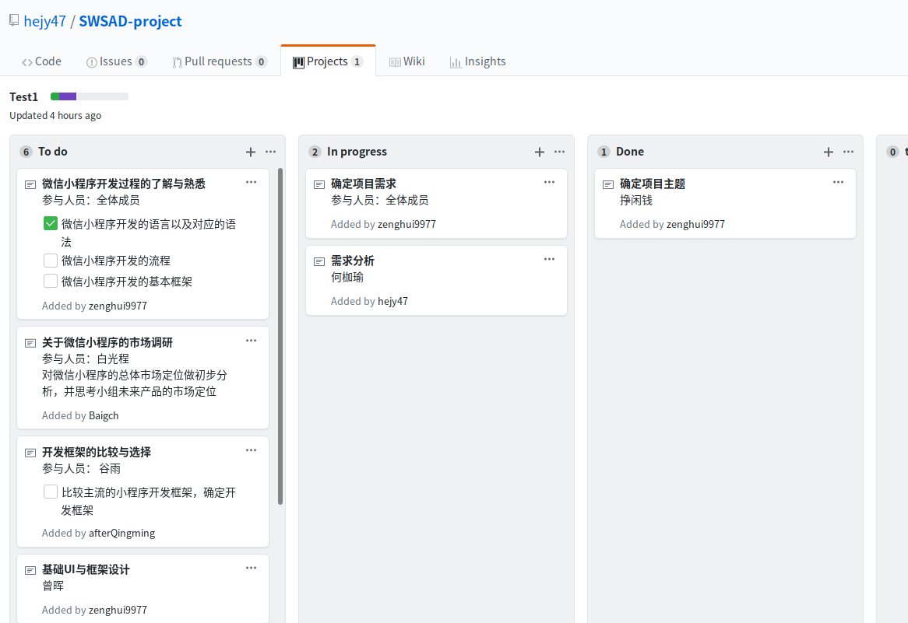

# 系统分析-第二次作业

        1、简答题

            用简短的语言给出对分析、设计的理解。
            用一句话描述面向对象的分析与设计的优势。
            简述 UML（统一建模语言）的作用。考试考哪些图？
            从软件本质的角度，解释软件范围（需求）控制的可行性

        2、项目管理实践

            看板使用练习（提交看板执行结果贴图，建议使用 Git project）
                    使用截图工具（png格式输出），展现你团队的任务 Kanban
                    每个人的任务是明确的。必须一周后可以看到具体结果
                    每个人的任务是1-2项
                    至少包含一个团队活动任务
            UML绘图工具练习（提交贴图，必须使用 UMLet）
                    请在 参考书2 或 教材 中选择一个类图（给出参考书页码图号）

##   简答题
    
1. 用简短的语言给出对分析、设计的理解。
    
    需求分析解决的是“做什么”的问题， 系统设计解决的是“怎么做”的问题。
    
    需求分析所要做的工作是深入描述软件的功能和性能，确定软件设计的限制和软件同其他系统元素的接口细节，定义软件的其他有效性需求，细化软件要处理的数据域。用一句话概括就是：需求分析主要是确定待开发软件的功能、性能、数据、界面等要求。

    软件设计是一个把软件需求变换成软件表示的过程。最初这种表示只是描绘出软件的总体框架，然后再进一步细化，并在此框架中填入细节。
    
2. 用一句话描述面向对象的分析与设计的优势。

    面向对象方法以客观世界中的对象为中心，其分析和设计思想符合人们的思维方式，分析和设计的结构与客观世界的实际比较接近，容易被人们接受。

3. 简述 UML（统一建模语言）的作用。考试考哪些图？

    UML是一种开放的建模语言，用于说明、可视化、构建和编写一个正在开发的、面向对象的、软件密集系统的制品的开放方法。
    
    uml有一共14种图
    
    - 结构性图形（Structure diagrams）强调的是系统式的建模：
        - 静态图（static diagram）
            - 类图
            - 对象图
            - 包图
        - 实现图（implementation diagram）
            - 组件图
            - 部署图
        - 剖面图
        - 复合结构图

    - 行为式图形（Behavior diagrams）强调系统模型中触发的事件：

        - 活动图
        - 状态图
        - 用例图

    - 交互性图形（Interaction diagrams），属于行为图形的子集合，强调系统模型中的资料流程：

        - 通信图
        - 交互概述图（UML 2.0）
        - 时序图（UML 2.0）
        - 时间图（UML 2.0）

4. 从软件本质的角度，解释软件范围（需求）控制的可行性

    - 软件的本质特性
        
        complexity 复杂性
        
        conformity 一致性
    
        changeability 可变性
    
        invisibility 不可视性

    软件的本质特性以及软件需求的易变性所可能带来的潜在的巨大风险意味着完全控制软件范围是一件几乎不可能的事情，但我们必须在一定程度上控制软件范围。
    
    软件分析的目的不是找出所有的需求并完善而是确认有效的功能与需求，去伪存真不断满足客户需要。软件设计也不是追求最先进技术，而是控制变化附加的成本，使得软件生产的预算、时间等能在掌控之中。

##  2.  项目管理实践

    看板使用练习（提交看板执行结果贴图，建议使用 Git project）
        使用截图工具（png格式输出），展现你团队的任务 Kanban
        每个人的任务是明确的。必须一周后可以看到具体结果
        每个人的任务是1-2项
        至少包含一个团队活动任务

    UML绘图工具练习（提交贴图，必须使用 UMLet）
        请在 参考书2 或 教材 中选择一个类图（给出参考书页码图号）

        教材 13页 图1-6

